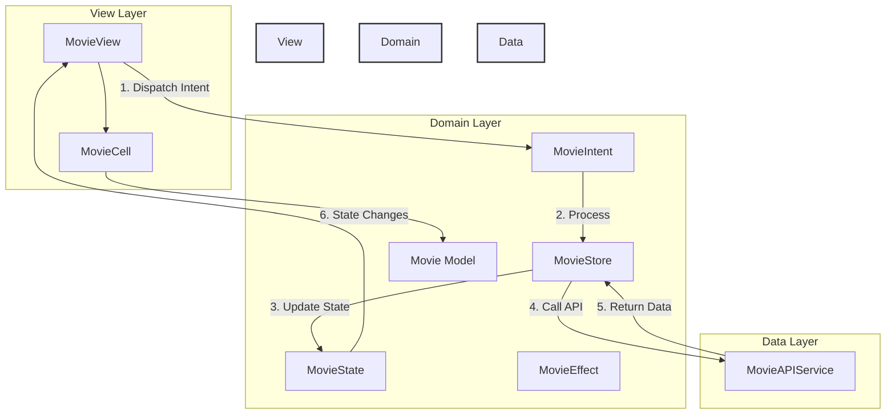

# MVIExam
mvi 예제코드

```mermaid
flowchart TD
    subgraph View Layer
        MV[MovieView]
        MC[MovieCell]
    end
    
    subgraph Domain Layer
        MS[MovieStore]
        MST[MovieState]
        MI[MovieIntent]
        ME[MovieEffect]
        MM[Movie Model]
    end
    
    subgraph Data Layer
        API[MovieAPIService]
    end

    MV --"1. Dispatch Intent"--> MI
    MI --"2. Process"--> MS
    MS --"3. Update State"--> MST
    MS --"4. Call API"--> API
    API --"5. Return Data"--> MS
    MST --"6. State Changes"--> MV
    MV --> MC
    MC --> MM

    style View Layer fill:#f9f,stroke:#333,stroke-width:2px
    style Domain Layer fill:#bbf,stroke:#333,stroke-width:2px
    style Data Layer fill:#bfb,stroke:#333,stroke-width:2px
```
